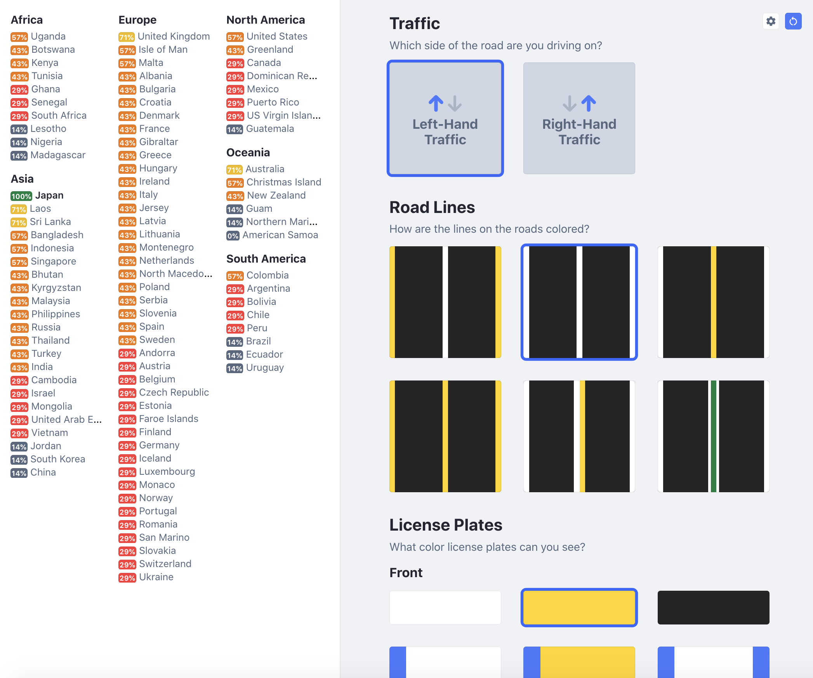

<div align="center">
    <h1>📍 <a href="https://mhollingshead.github.io/geotrainr">GeoTrainr</a></h1>
    <p>An <a href="https://mhollingshead.github.io/geotrainr">online tool</a> to help practice your country recognition skills using several quick determinants.</p>
</div>



## Usage

This application is intended to help you recognize potential locations using various geographic, infrastructural, and linguistic cues. 

There are several categories *(currently [traffic direction](#traffic-direction), [road lines](#road-lines), [license plates](#license-plates), [watermark](#watermark), [sun direction](#sun-direction), [snow](#snow), and [language](#language))* with several options that apply to various countries around the world. Whenever an option is selected, all applicable countries will be given a point and their score will be determined by the percentage of points that apply to them. All countries are then sorted based on their score and listed.

> The purpose of this tool is not to cheat at games like GeoGuessr. Any situation where cheating may be beneficial *(e.g. battle royales)* usually require speed, and selecting several options takes time and rarely results in a single, definitive result. Instead, this tool should be used to practice recognizing geographical tells quickly. Many top players do this automatically, but this kind of tool could prove useful to players who are just starting out.

### Using GeoTrainr Online

To use GeoTrainr online, you can access the application via GitHub Pages **[here](https://mhollingshead.github.io/geotrainr)**.

### Installing and Running Locally

If you want to customize GeoTrainr or are interested in contributing, you can install and run the application locally by following the steps below:

1. In your terminal of choice, run `git clone https://github.com/mhollingshead/geotrainr`. *Alternatively, you can download and unzip the repo [here]()*.
2. `cd` into the project directory and run `npm install` to install the necessary dependencies.
3. Finally, run `npm start` to start the application. A new browser tab should open to [http://localhost:3000](http://localhost:3000) where you should be able to use GeoTrainr.

Have a look at the [**Under the Hood** section](#under-the-hood) to learn more about adding / editing country data.

## Under the Hood

GeoTrainr is a fairly simple react application that scores countries based on several determinants. At the moment, only countries with **common, uncommon, or rare official Street View coverage** are considered. If you're interested, the list of such countries and their commonality *(scored from **rare** `1` to **common** `3`)* is as follows:

```json
{ "Botswana": 3, "Denmark": 3, "Croatia": 3, "Czech Republic": 3, "Estonia": 3, "Latvia": 3, "San Marino": 3, "Slovakia": 3, "Canada": 3, "Andorra": 3, "Bulgaria": 3, "Finland": 3, "Hungary": 3, "Ireland": 3, "Isle of Man": 3, "Italy": 3, "Jersey": 3, "Lithuania": 3, "Monaco": 3, "Netherlands": 3, "Poland": 3, "Portugal": 3, "Romania": 3, "Slovenia": 3, "Spain": 3, "Sweden": 3, "United Kingdom": 3, "United States": 3, "Australia": 3, "Brazil": 3, "Peru": 3, "South Africa": 3, "Bhutan": 3, "Cambodia": 3, "Israel": 3, "Japan": 3, "Taiwan": 3, "France": 3, "Greece": 3, "Switzerland": 3, "Turkey": 3, "New Zealand": 3, "Argentina": 3, "Chile": 3, "Uganda": 3, "Bangladesh": 3, "Laos": 3, "Malaysia": 3, "Mongolia": 3, "Thailand": 3, "North Macedonia": 3, "Norway": 3, "Serbia": 3, "Ukraine": 3, "Greenland": 3, "Mexico": 3, "American Samoa": 3, "Bolivia": 3, "Colombia": 3, "Ecuador": 3, "Uruguay": 3, "Tunisia": 3, "Indonesia": 3, "Kyrgyzstan": 3, "Philippines": 3, "Russia": 3, "Sri Lanka": 3, "United Arab Emirates": 3, "Albania": 3, "Gibraltar": 3, "Malta": 3, "Montenegro": 3, "Puerto Rico": 3, "Eswatini": 3, "Ghana": 3, "Lesotho": 3, "Nigeria": 3, "Senegal": 3, "Jordan": 3, "Belgium": 3, "Germany": 3, "Iceland": 3, "Luxembourg": 3, "Guatemala": 3, "US Virgin Islands": 3, "Kenya": 3, "Austria": 3, "Curaçao": 3, "Singapore": 3, "South Korea": 3, "Madagascar": 2, "Vietnam": 3, "Dominican Republic": 3, "Christmas Island": 3, "India": 2, "Faroe Islands": 3, "Guam": 3, "Northern Mariana Islands": 3, "China": 1 }
```

Each category, their options, and the countries associated with each option are largely determined using data from [geohints.com](https://geohints.com/), with the exception of a few categories which were pieced together using several other sources. For detailed information about each category, refer to the [**Country Data** section](#country-data) below.

### Country Data

Country data for each category is managed by a large `data` object which stores an array of applicable countries for each option of each category. 

Some categories may be split up into subcategories– `plates`, for example, is split up into `front` and `back` to avoid needing to list every relevant combination of front and rear license plate colors.

At the moment, the following categories are provided:

* [Traffic Direction](#traffic-direction)
* [Road Lines](#road-lines)
* [License Plates](#license-plates)
* [Watermark](#watermark)
* [Sun Direction](#sun-direction)
* [Snow](#snow)
* [Language](#language)

### Traffic Direction

While fairly straightforward, this category is one of the most immediately noticeable determinants when given a location. Every country has either **left-hand traffic** *(where drivers keep to their left)* or **right-hand traffic** *(where drivers keep to their right)*. This can be determined fairly easily when given a location and is useful for narrowing your search.

Data for this category was gathered from [geohints.com/Driving.html](https://geohints.com/Driving.html). Here are the country arrays for each option:

**Left-hand Traffic**
```javascript
["Botswana", "Eswatini", "Kenya", "Lesotho", "South Africa", "Uganda", "Bangladesh", "Bhutan", "Christmas Island", "India", "Indonesia", "Japan", "Malaysia", "Singapore", "Sri Lanka", "Thailand", "Ireland", "Isle of Man", "Jersey", "Malta", "United Kingdom", "US Virgin Islands", "Australia", "New Zealand"]
```

**Right-hand Traffic**
```javascript
["China", "Ghana", "Madagascar", "Nigeria", "Senegal", "Tunisia", "Cambodia", "Israel", "Jordan", "Kyrgyzstan", "Laos", "Mongolia", "Philippines", "Russia", "South Korea", "Taiwan", "United Arab Emirates", "Vietnam", "Albania", "Andorra", "Austria", "Belgium", "Bulgaria", "Croatia", "Czech Republic", "Denmark", "Estonia", "Faroe Islands", "Finland", "France", "Germany", "Gibraltar", "Greece", "Hungary", "Iceland", "Italy", "Latvia", "Lithuania", "Luxembourg", "Monaco", "Montenegro", "Netherlands", "North Macedonia", "Norway", "Poland", "Portugal", "Romania", "San Marino", "Serbia", "Slovakia", "Slovenia", "Spain", "Sweden", "Switzerland", "Turkey", "Ukraine", "Canada", "Curaçao", "Dominican Republic", "Greenland", "Guatemala", "Mexico", "Puerto Rico", "United States", "American Samoa", "Guam", "Northern Mariana Islands", "Argentina", "Bolivia", "Brazil", "Chile", "Colombia", "Ecuador", "Peru", "Uruguay"]
```

### Road Lines

Road lines help narrow down a country search using the coloring of the outside and middle lines on a road. Unlike traffic direction, this category is not mutually exclusive as many countries could have several different ways to color road lines. It's also worth mentioning that this category is based on **colors only**, i.e. dashed/non-dashed lines, double/single lines, etc. are not considered *(since all countries have many different types of lines)*.

Data for this category was gathered from [geohints.com/Lines.html](https://geohints.com/Lines.html). `data.roads` is represented as an array of country arrays in order to avoid naming each color combination, so each option is obtained using an index rather than a key. Here are the country arrays for each option:

**`0`: Yellow Outside, White Middle**
```javascript
["Russia", "Botswana", "Eswatini", "Lesotho", "Nigeria", "South Africa", "Israel", "Jordan", "Singapore", "United Arab Emirates", "Gibraltar", "Ireland", "Isle of Man", "Jersey", "United Kingdom", "New Zealand"]
```

**`1`: White Outside, White Middle**
```javascript
["Ghana", "Madagascar", "Senegal", "Tunisia", "Uganda", "Bangladesh", "Bhutan", "Christmas Island", "India", "Indonesia", "Japan", "Kyrgyzstan", "Laos", "Malaysia", "Mongolia", "Philippines", "Russia", "Singapore", "Sri Lanka", "Vietnam", "Albania", "Andorra", "Austria", "Belgium", "Bulgaria", "Croatia", "Czech Republic", "Denmark", "Estonia", "Faroe Islands", "Finland", "France", "Germany", "Gibraltar", "Greece", "Hungary", "Iceland", "Isle of Man", "Italy", "Latvia", "Lithuania", "Luxembourg", "Malta", "Monaco", "Montenegro", "Netherlands", "North Macedonia", "Poland", "Portugal", "Romania", "San Marino", "Serbia", "Slovakia", "Slovenia", "Spain", "Sweden", "Switzerland", "Turkey", "Ukraine", "United Kingdom", "Curaçao", "Greenland", "Australia", "New Zealand", "Argentina", "Bolivia", "Chile", "Peru", "Ireland"]
```

**`2`: White Outside, Yellow Middle**
```javascript
["Japan", "Kenya", "Uganda", "Cambodia", "Indonesia", "Philippines", "South Korea", "Taiwan", "Thailand", "Vietnam", "Albania", "Finland", "Norway", "Canada", "Dominican Republic", "Guatemala", "Mexico", "Puerto Rico", "United States", "US Virgin Islands", "American Samoa", "Guam", "New Zealand", "Northern Mariana Islands", "Argentina", "Bolivia", "Brazil", "Colombia", "Ecuador", "Peru"]
```

**`3`: Yellow Outside, Yellow Middle**
```javascript
["South Korea", "North Macedonia", "Australia", "New Zealand", "Chile", "United Arab Emerates"]
```

**`4`: White Outside, White and Yellow Middle**
```javascript
["Finland", "Philippines", "New Zealand", "Argentina", "Uruguay"]
```

**`5`: White Outside, White and Green Middle**
```javascript
["Netherlands"]
```

### License Plates

License plates are particularly useful for narrowing down your search to just a few countries. For example, you may know that the road lines are all white and traffic flows on the right-hand side, but this is almost every country in Europe. However, if you happen to see a white license plate with blue bars on the left and right side, then you can safely assume you're in Italy.

`data.plates` is split into two subcategories: `data.plates.front` and `data.plates.back`. Once again, each subcategory is represented by an array of country arrays to avoid long, confusing keys for each plate description.

Data for this category was gathered from [geohints.com/LicensePlates.html](https://geohints.com/LicensePlates.html). Since there are many styles of license plates, each plate *(front and back for any current or previous plate design)* is generalized by **main color** and **noticeable secondary features** *(such as a panel or border)*. Shape and size of the plate is not currently considered.

There are too many plate styles to list, but if you're interested feel free to check out the data [here]().

### Watermark

Sometimes the copyright year in the watermark can help narrow down your search. It probably isn't worth memorizing every possible list of countries for each year, so this category is more useful for narrowing down existing searches.

Data for this category was gathered from [geohints.com/Years.html](https://geohints.com/Years.html). `data.watermark` is indexed using the respective year *(ranging from `2011` to `2022`)* as well as `none` for some countries whose Street Views don't contain a watermark. *Note: `none` should only be selected if you're **absolutely sure** that there are no watermarks **anywhere** in the frame*.

### Sun Direction

One well-known strategy for narrowing down a search is to determine which hemisphere you're in by determining which direction the sun is in. When looking directly at the sun, if the compass reads **due north**, you're most-likely in the **southern hemisphere**. If the compass reads **due south**, then you're most-likely in the **northern hemisphere**.

Data for this category was gathered from [wikipedia.org/wiki/Northern_Hemisphere](https://en.wikipedia.org/wiki/Northern_Hemisphere) and [wikipedia.org/wiki/Southern_Hemisphere](https://en.wikipedia.org/wiki/Southern_Hemisphere). The data is stored in `data.hemisphere` and is indexed using the keys `northern` and `southern`. Here are the country arrays for each option:

**Northern Hemisphere**
```javascript
["Algeria", "Benin", "Burkina Faso", "Cameroon", "Cape Verde", "Central African Republic", "Chad", "Djibouti", "Dominican Republic", "Egypt", "Eritrea", "Ethiopia", "Gambia", "Ghana", "Guinea", "Guinea-Bissau", "Ivory Coast", "Liberia", "Libya", "Mali", "Mauritania", "Morocco", "Niger", "Nigeria", "Senegal", "Sierra Leone", "South Sudan", "Sudan", "Togo", "Tunisia", "Equatorial Guinea", "Kenya", "São Tomé and Príncipe", "Somalia", "Uganda", "Afghanistan", "Armenia", "Azerbaijan", "Bahrain", "Bangladesh", "Bhutan", "Brunei", "Cambodia", "China", "Cyprus", "Georgia", "India", "Iran", "Iraq", "Israel", "Jordan", "Kazakhstan", "Kuwait", "Kyrgyzstan", "Laos", "Lebanon", "Malaysia", "Mongolia", "Myanmar", "Nepal", "North Korea", "Oman", "Pakistan", "Palestine", "Philippines", "Qatar", "Saudi Arabia", "Singapore", "South Korea", "Sri Lanka", "Tajikistan", "Thailand", "Turkey", "Turkmenistan", "United Arab Emirates", "Uzbekistan", "Vietnam", "Yemen", "Maldives", "Democratic Republic of the Congo", "Gabon", "Republic of the Congo", "Indonesia", "Belize", "Canada", "Costa Rica", "El Salvador", "Guatemala", "Guyana", "Honduras", "Mexico", "Nicaragua", "Panama", "Suriname", "United States", "Venezuela", "Colombia", "Brazil", "Ecuador", "Albania", "Andorra", "Austria", "Belarus", "Belgium", "Bosnia and Herzegovina", "Bulgaria", "Croatia", "Czech Republic", "Denmark", "Estonia", "Finland", "Germany", "Greece", "Hungary", "Iceland", "Ireland", "Italy", "Latvia", "Liechtenstein", "Lithuania", "Luxembourg", "Malta", "Moldova", "Monaco", "Montenegro", "Netherlands", "North Macedonia", "Norway", "Poland", "Portugal", "Romania", "Russia", "San Marino", "Serbia", "Slovakia", "Slovenia", "Spain", "Sweden", "Switzerland", "Ukraine", "Vatican City", "France", "United Kingdom", "Jersey", "Curaçao", "Cyprus", "Faroe Islands", "Jamaica", "Montserrat", "US Virgin Islands", "Puerto Rico", "Greenland", "Grenada", "Guyana", "Haiti", "Guam", "Japan", "Northern Mariana Islands", "São Tomé and Príncipe", "Palau", "Gibraltar", "Isle of Man"]
```

**Southern Hemisphere**
```javascript
["American Samoa", "Angola", "Argentina", "Australia", "Bolivia", "Botswana", "Brazil", "Burundi", "Chile", "Christmas Island", "Colombia", "Comoros", "DR Congo", "Ecuador", "Equatorial Guinea", "Eswatini", "Fiji", "Gabon", "Indonesia", "Kenya", "Kiribati", "Lesotho", "Madagascar", "Malawi", "Maldives", "Mauritius", "Mozambique", "Namibia", "Nauru", "New Zealand", "Papua New Guinea", "Paraguay", "Peru", "Republic of the Congo", "Rwanda", "Samoa", "Sao Tome and Principe", "Seychelles", "Solomon Islands", "Somalia", "South Africa", "Tanzania", "Tonga", "Tuvalu", "Uganda", "Uruguay", "Vanuatu", "Zambia", "Zimbabwe"]
```

*Note: Once again, you should only select an option if the sun is **directly north** or **directly south**, anything in between is not definite.*

### Snow

This is another fairly straightforward category that can be used for narrowing down a country search when there is snow visible.

Data for this category was gathered from [geohints.com/Snow.html](https://geohints.com/Snow.html). `data.snow` does not need to be indexed as it is itself an array of countries with possible snow coverage. Here is the country array:

```javascript
["Japan", "Kyrgyzstan", "Mongolia", "Russia", "South Korea", "Andorra", "Austria", "Belgium", "Bulgaria", "Croatia", "Czech Republic", "Faroe Islands", "Finland", "France", "Denmark", "Germany", "Greece", "Hungary", "Iceland", "Italy", "Norway", "Portugal", "Slovakia", "Slovenia", "Spain", "Sweden", "Switzerland", "Turkey", "United Kingdom", "Canada", "Greenland", "United States", "Australia", "New Zealand", "Argentina", "Chile"],
```

### Language

One very useful *(but very difficult)* indication of what country you're in is the language that can be seen on signs, buildings, etc. Rather than listing every possible language, `data.language` is split into two subcategories: **alphabet** and **diacritics**.

Data for this category was gathered from [Wikipedia's Language Recognition Chart](https://en.wikipedia.org/wiki/Wikipedia:Language_recognition_chart) along with many other language and country Wikipedia entries.

#### Alphabet

The first determinant when identifying a language is the alphabet or characters that the language uses. The purpose of this subcategory is not to memorize every possible character of every single language, but rather identify visual similarities between characters you may be seeing and the sample characters provided. This is because many languages *(Mandarin, for example)* have thousands of characters which can't all be presented in a clear, organized way.

Here are the various alphabets, some sample characters, and their associated country arrays:

* **`latin`** 
  
  A B C D E F G H I J K L M N O P Q R S T U V W X Y Z a b c d e f g h i j k l m n o p q r s t u v w x y z

  ```javascript
  ['United States', 'Canada', 'United Kingdom', 'Scotland', 'South Africa', 'Australia', 'New Zealand', 'Bahamas', 'Botswana', 'Nigeria', 'Fiji', 'Ghana', 'Singapore', 'Ireland', 'Jamaica', 'Indonesia', 'Netherlands', 'Denmark', 'Norway', 'Finland', 'Sweden', 'Estonia', 'Germany', 'Iraq', 'Romania', 'Moldova', 'Serbia', 'Turkey', 'Iceland', 'Hungary', 'Andorra', 'Belgium', 'France', 'Luxembourg', 'Switzerland', 'Portugal', 'Spain', 'Brazil', 'Argentina', 'Bolivia', 'Chile', 'Columbia', 'Costa Rica', 'Cuba', 'Dominican Republic', 'Ecuador', 'Guatemala', 'Honduras', 'Mexico', 'Nicaragua', 'Panama', 'Paraguay', 'Peru', 'Uruguay', 'Venezuela', 'Italy', 'San Marino', 'Poland', 'Slovenia', 'Bosnia', 'Montenegro', 'Croatia', 'Austria', 'Czech Republic', 'Latvia', 'Lithuania', 'Vietnam', 'Puerto Rico', 'US Virgin Islands', 'Greenland', 'American Samoa', 'Guam', 'Christmas Island', 'Northern Mariana Islands', 'Colombia', 'Slovakia', 'Isle of Man', 'Kenya', 'Lesotho', 'Senegal', 'Tunisia', 'Uganda', 'Madagascar', 'Faroe Islands', 'Philippines', 'Malaysia']
  ```

* **`cyrillic`** 

  А Б В Г Д Е Ж З И К Л М Н О П Р С Т У Ф Х Ц Ч Ш а б в г д е ж з и к л м н о п р с т у ф х ц ч ш

  ```javascript
  ['Bulgaria', 'Belarus', 'Russia', 'Ukraine', 'Kyrgyzstan', 'Mongolia', 'Romania', 'Serbia', 'Montenegro', 'North Macedonia']
  ```

* **`greek`**

  Α Β Γ Δ Ε Ζ Η Θ Ι Κ Λ Μ Ν Ξ Ο Π Ρ Σ Τ Υ Φ Χ Ψ Ω α β γ δ ε ζ η θ ι κ λ μ ν ξ ο π ρ σ ς τ υ φ χ ψ ω

  ```javascript
  ['Greece', 'Cyprus', 'Albania']
  ```

* **`arabic`**

  ا ب ت ث ج ح خ د ذ ر ز س ش ص ض ط ظ ع غ ف ق ك ل م ن ه و ي

  ```javascript
  ['Egypt', 'Iraq', 'Jordan', 'Tunusia', 'United Arab Emirates']
  ```

* **`hebrew`**

  א ב ג ד ה ו ז ח ט י כ ל מ נ ס ע פ צ ק ר ש ת

  ```javascript
  ['Israel']
  ```

* **`japanese`**

  あ い う え お か き く け こ さ し す せ そ た ち つ て と な に ぬ ね の は ひ ふ へ ほ ま み む め

  ```javascript
  ['Japan']
  ```

* **`mandarin`**

  诶 比 西 迪 伊 弗 吉 尺 艾 杰 开 勒 马 娜 哦 屁 吾 儿 丝 提 维 豆 贝 尔 克 斯 贼 德

  ```javascript
  ['China', 'Singapore', 'Taiwan']
  ```

* **`korean`**

  것 수 나 그 거 년 한 말 일 이 씨 안 더 집 속 데 앞 중 잘 원 명 개 다 좀 너 점 곳 안 위 돈 날 후 몸 왜 물

  ```javascript
  ['South Korea']
  ```

* **`khmer`**

  ក ខ គ ឃ ង ច ឆ ជ ឈ ញ ដ ឋ ឌ ឍ ណ ត ថ ទ ធ ន ប ផ ព ភ ម ស ហ យ រ ល ឡ អ

  ```javascript
  ['Cambodia']
  ```

* **`thai`**

  ก ข ฃ ค ฅ ฆ ง จ ฉ ช ฌ ญ ฎ ฐ ฑ ฒ ณ ด ถ ท ธ น ป ผ ฝ พ ฟ ม ย ร ฤ ล ฦ ว ศ ษ ส ห อ ฯ ะ เ โ ไ ๅ ๆ

  ```javascript
  ['Thailand', 'Laos']
  ```

* **`bengali`**

  অ আ কা কি কী উ কু ঊ কূ ঋ কৃ এ কে ঐ কৈ ও কো ঔ কৌ ক্ ক ত্‍ কং কঃ কঁ ক খ গ ঘ ঙ চ ছ জ ঝ

  ```javascript
  ['Bangladesh', 'India']
  ```

* **`devanāgarī`**

  अ आ इ ई उ ऊ ऋ ॠ ऌ ॡ ऍ ऎ ए ऐ ऑ ऒ ओ ओ क ख ग घ ङ च छ ज झ ञ ट ठ ड ढ ण त थ द ध न प फ ब भ

  ```javascript
  ['India']
  ```

* **`gurmukhi`**

  ਅ ਆ ਇ ਈ ਉ ਊ ਏ ਐ ਓ ਔ ਕ ਖ ਗ ਘ ਙ ਚ ਛ ਜ ਝ ਞ ਟ ਠ ਡ ਢ ਣ ਤ ਥ ਦ ਧ ਨ ਪ ਫ ਬ ਭ ਮ ਯ ਰ ਲ ਲ਼ ਵ ਸ਼ ਸ ਹ

  ```javascript
  ['India', 'Pakistan']
  ```

* **`gujarati`**

  અ આ ઇ ઈ ઉ ઊ ઋ ઌ ઍ એ ઐ ઑ ઓ ઔ ક ખ ગ ઘ ઙ ચ છ જ ઝ ઞ ટ ઠ ડ ઢ ણ ત થ દ ધ ન પ ફ બ ભ મ

  ```javascript
  ['India', 'Pakistan']
  ```

These samples are lifted directly from [Wikipedia](https://en.wikipedia.org/wiki/Wikipedia:Language_recognition_chart), so hopefully they don't translate into something ridiculous. 

It should be noted that I am by no means a language expert. My process for extracting this data was to:

1. take an alphabet,
2. determine which languages use that alphabet,
3. determine which countries list those languages as an official language, and
4. build a set by taking the union of those countries. 

The main idea is to be able to find similarities in character structures, not to memorize every language in the world.

#### Diacritics

The second subcategory of `data.language`, **diacritics**, are used to narrow down an alphabet to a specific language by identifying more language-specific characters. 

I won't list every diacritic and their country arrays since there are hundreds and there is a lot of overlap, but my process for building the country arrays is as follows:

1. Each language of each alphabet is mapped to an object with the following attributes:
    * `countries`, an array of countries who list the language as a primary language, and
    * `diacritics`, an array of characters in the language that extend the more general alphabet.
2. Take the union of all `language.diacritics` arrays to get an array of all possible diacritics across all languages.
3. Map each diacritic to the union of all `language.countries` arrays where `language.diacritics` contains the current character.
4. The result is a dictionary mapping a character to all the countries who have a primary language that contains that diacritic.

Once again, I'm no language expert. Sometimes identifying some character on a sign or building can quickly narrow your search to just a few countries. For example, if you see the character **Ő** on a billboard, you know right away that you're most likely in Hungary without needing to explicitly identify the language as Hungarian.

## Contributing

GeoTrainr is a work in progress. If you want to contribute to the project, feel free to raise a PR. If you think you've identified a useful category, you're welcome to submit a suggestion as an [issue]().